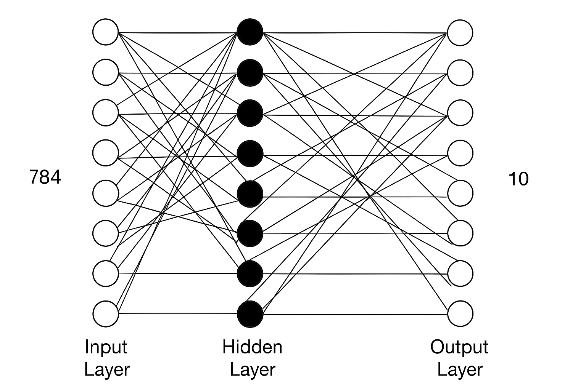

# Numpy Neural Network
In this project I am going to explore a basic example of a Neural work the and many of the low level ideas and math behind it in order to get a deeper understanding before utilizing Tensorflow, sck-kit, Pytorch, and other pre-made libraries.
## Preprocess
This is simply used to load the data in with the main 28x28 image being the x_train, y_train, x_test, y_test
```python
import numpy as np
import pandas as pd
import tensorflow as tf

(x_train, y_train), (x_test, y_test) = tf.keras.datasets.mnist.load_data()
# note tensorflow is only used to load the data in
```

With the images current in a 28 by 28 sized 2d array we need to flattended to a 1d array sized 784 by 1 in order for the fully contected layers of the NN to be processed as input features

```python
x_train_flat = x_train.reshape(-1, 28*28).astype(np.float32) / 255.0
```

The matrix is then split into the training data and the test data and then transposed as the feature vectors are the rows and the columns themself are the features (The image).

```python
df = pd.DataFrame(x_train_flat)
df['label'] = y_train

# Convert to numpy and shuffle
data = np.array(df)
np.random.shuffle(data)

m, n = data.shape
data_dev = data[0:10000].T
Y_dev = data_dev[n-1].astype(int)
X_dev = data_dev[0:n-1].astype(np.float32)

data_train = data[10000:m].T
Y_train = data_train[n-1].astype(int)
X_train = data_train[0:n-1].astype(np.float32)
```

### Overview 

The simple NN has 3 total layers, the input layer, the hidden layer, and the output layer. The input layer is the first layer (left more) that takes in the input as a matrix. In my example it is the flattend and transposed 784 x 1 matrix. The next layer to the right is the hidden layer and its



After all the preprocessing and matrix manipulation we now need to initialize the weights and basis. all the weights are applied between the nodes and the basis are applied at all the nodes are the input layer. 

We start with the weights as randomized and all the basis as 0 zeros. These are all set up as matrices. 

```python
def init_params():
    w1 = np.random.randn(10, 784) * 0.01
    b1 = np.zeros((10, 1))
    w2 = np.random.randn(10, 10) * 0.01
    b2 = np.zeros((10, 1))
    return w1, b1, w2, b2
```

### Foward Propigation

Forward propagation is the process of taking input data and passing it through the layers of the neural network to produce an output. This involves calculating a weighted sum of the inputs at each neuron in a layer, adding a bias, and then applying an activation function. The output of one layer becomes the input to the next layer, and this process continues until the signal reaches the final output layer, which provides the network's prediction.

$$
ReLU(x) = \max(0, x)
$$


$$
ReLU'(x) =
\begin{cases}
1 & \text{if } x>0 \\
0 & \text{if } x\leq0
\end{cases}
$$


$$
\mathrm{softmax}(x_i) = \frac{e^{x_i}}{\sum_j e^{x_j}}
$$


```python
def ReLu(Z):
    return np.maximum(0, Z)

def derivative_ReLu(Z):
    return Z > 0

def Softmax(Z):
    expZ = np.exp(Z - np.max(Z, axis=0, keepdims=True))  # numerical stability
    return expZ / np.sum(expZ, axis=0, keepdims=True)

def forward_propagation(X, w1, b1, w2, b2):
    z1 = np.dot(w1, X) + b1
    a1 = ReLu(z1)
    z2 = np.dot(w2, a1) + b2
    a2 = Softmax(z2)
    return a1, a2, z1, z2
```

### Backpropagation 
Backpropagation is the crucial step in training a neural network where the network learns from its mistakes. After the forward propagation step, we have the network's predictions, and we can calculate how far off these predictions are from the actual values using the Loss function.

The core idea of backpropagation is to take this calculated error (the "Loss") and propagate it backwards through the network, layer by layer. As we move backward, we calculate the gradient of the Loss function with respect to each of the network's parameters (weights and biases). The gradient essentially tells us in which direction, and by how much, we need to adjust each parameter to reduce the error.

Let's break down the formulas you provided:

Loss Function:
$$
\text{Loss} = -\frac{1}{n} \sum_{i=1}^n \log(a_2[y_i, i])
$$
This formula calculates the average negative logarithm of the predicted probability for the correct class across all training examples (m). It quantifies how well the network is performing. A lower loss value indicates better performance.

Derivative of the Loss with respect to the output layer (dZ 
2
​
 ):
$$
dZ_2 = a_2 - Y_{\text{one-hot}}
$$
This calculates the error at the output layer. a2 represents the predicted probabilities from the Softmax activation, and Y 
one-hot
​
  is the one-hot encoded representation of the true labels. The difference between these tells us how much the network's output deviated from the correct answer.

Gradient of the Loss with respect to the second weight matrix (dW 
2
​
 ):
$$
dW_2 = \frac{1}{m} dZ_2 \cdot a_1^T
$$
This formula calculates how much the second layer's weights (w2) contributed to the error. It does this by taking the error at the output layer (dZ_2) and multiplying it by the transpose of the activations from the hidden layer (a_1^T). The result is then averaged over the number of training examples (m). This gradient will be used to update w2 in the opposite direction to reduce the loss.

Gradient of the Loss with respect to the second bias vector (db 
2
​
 ):
$$
db_2 = \frac{1}{m} \sum_{i=1}^m dZ_2^{(i)}
$$
This calculates how much the second layer's biases (b2) contributed to the error. It's the average of the error at the output layer (dZ_2) summed across all training examples. This gradient will be used to update b2.

Derivative of the Loss with respect to the hidden layer (dZ 
1
​
 ):
$$
dZ_1 = (w_2^T \cdot dZ_2) \cdot \text{ReLU}'(z_1)
$$
This propagates the error back to the hidden layer. It takes the error from the output layer (dZ_2), weights it by the transpose of the second weight matrix (w_2^T), and then applies the derivative of the ReLU activation function (\text{ReLU}'(z_1)). This tells us how much the hidden layer's activations contributed to the error in the output.

Gradient of the Loss with respect to the first weight matrix (dW 
1
​
 ):
$$
dW_1 = \frac{1}{m} dZ_1 \cdot X^T
$$
Similar to dW 
2
​
 , this calculates how much the first layer's weights (w1) contributed to the error. It takes the error propagated back to the hidden layer (dZ_1) and multiplies it by the transpose of the input data (X^T), averaged over the training examples (m). This gradient will be used to update w1.

Gradient of the Loss with respect to the first bias vector (db 
1
​
 ):
$$
db_1 = \frac{1}{m} \sum_{i=1}^m dZ_1^{(i)}
$$
This calculates how much the first layer's biases (b1) contributed to the error. It's the average of the error at the hidden layer (dZ_1) summed across all training examples. This gradient will be used to update b1.

In essence, backpropagation uses the chain rule of calculus to efficiently calculate these gradients across all the layers of the network. These gradients are then used by the Gradient Descent algorithm to update the weights and biases in a way that minimizes the Loss function, thus improving the network's performance over time.
For backprogations we are going to take the output that was given and then go backwards as the name implies and find the derivative of the loss function in respect to its respective element at each layer. 

$$
\text{Loss} = -\frac{1}{m} \sum_{i=1}^m \log(a_2[y_i, i])
$$


```python
def one_hot(Y):
    one_hot_Y = np.zeros((Y.size, Y.max() + 1))
    one_hot_Y[np.arange(Y.size), Y] = 1
    return one_hot_Y.T

def backward_propagation(X, z1, a1, w2, a2, Y):
    m = Y.size
    one_hot_Y = one_hot(Y)
    dZ2 = a2 - one_hot_Y
    dW2 = np.dot(dZ2, a1.T) / m
    db2 = np.sum(dZ2, axis=1, keepdims=True) / m
    dZ1 = np.dot(w2.T, dZ2) * derivative_ReLu(z1)
    dW1 = np.dot(dZ1, X.T) / m
    db1 = np.sum(dZ1, axis=1, keepdims=True) / m
    return dW1, db1, dW2, db2
```

### Gradient descent 

This is the part where the weights and basis are updated with the gradients that are calculated in Back Proprogation. 

```python
def update_params(w1, b1, w2, b2, dW1, db1, dW2, db2, learning_rate):
    w1 -= learning_rate * dW1
    b1 -= learning_rate * db1
    w2 -= learning_rate * dW2
    b2 -= learning_rate * db2
    return w1, b1, w2, b2

def gradient_descent(X, Y, iterations, alpha):
    w1, b1, w2, b2 = init_params()
    for i in range(iterations):
        a1, a2, z1, z2 = forward_propagation(X, w1, b1, w2, b2)
        dW1, db1, dW2, db2 = backward_propagation(X, z1, a1, w2, a2, Y)
        w1, b1, w2, b2 = update_params(w1, b1, w2, b2, dW1, db1, dW2, db2, alpha)
        if i % 10 == 0:
            one_hot_Y = one_hot(Y)
            loss = -np.mean(np.log(a2[Y, np.arange(Y.size)] + 1e-8))  # add epsilon for stability

            print(f"Iteration {i}: Loss = {loss:.4f}")
    return w1, b1, w2, b2
```

### Results

```python
# === Define prediction and accuracy functions ===
def predict(X, w1, b1, w2, b2):
    _, a2, _, _ = forward_propagation(X, w1, b1, w2, b2)
    return np.argmax(a2, axis=0)

def accuracy(X, Y, w1, b1, w2, b2):
    preds = predict(X, w1, b1, w2, b2)
    return np.mean(preds == Y) * 100

# === Test on training and dev sets ===
train_acc = accuracy(X_train, Y_train, w1, b1, w2, b2)
dev_acc = accuracy(X_dev, Y_dev, w1, b1, w2, b2)

print(f"Train Accuracy: {train_acc:.2f}%")
print(f"Dev Accuracy: {dev_acc:.2f}%")

# === (Optional) Test on official MNIST test set ===
x_test_flat = x_test.reshape(-1, 28*28).T.astype(np.float32) / 255.0
y_test = y_test.astype(int)

test_acc = accuracy(x_test_flat, y_test, w1, b1, w2, b2)
print(f"Test Accuracy: {test_acc:.2f}%")
```

On 2000 training epochs: 
Train Accuracy: 80.67%
Dev Accuracy: 80.94%
Test Accuracy: 81.17%

With a pretty simple model we were able to predict a hand written number 80% of the time. 